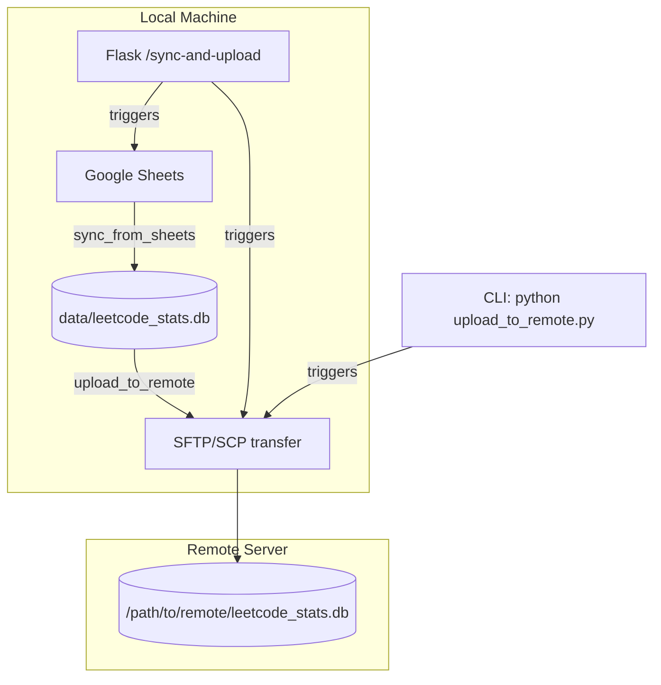

# Remote SQLite Upload via SSH — Implementation Plan

## Overview

Add a function that uploads the local SQLite database file (or the data from Google Sheets) to a remote server via **SFTP/SCP** over SSH.

---

## Architecture



**Two upload strategies:**

| Strategy | Description | When to Use |
|---|---|---|
| **File upload** | Upload the entire `.db` file via SFTP | Fast for small DBs; replaces remote DB entirely |
| **Row-level sync** | Parse local DB, send only new rows as JSON to a remote HTTP endpoint, remote inserts them | Preserves existing remote data; no HTTP server needed on remote |

The user wants **File upload via SFTP/SCP**, so that's the primary design.

---

## Files to Create/Modify

### 1. NEW: [`upload_to_remote.py`](upload_to_remote.py)

A standalone module with two approaches:

**Primary: SFTP via Paramiko** — uploads the `.db` file to a remote path.

```python
def upload_db_via_sftp(
    host: str,
    port: int,
    username: str,
    remote_path: str,
    key_filename: str | None = None,
    password: str | None = None,
    local_db_path: str | None = None,
) -> bool
```

**Fallback: SCP via subprocess** — uses system `scp` command (no extra deps).

```python
def upload_db_via_scp(
    host: str,
    remote_path: str,
    username: str,
    key_filename: str | None = None,
    local_db_path: str | None = None,
) -> bool
```

**Combined entry point:**
```python
def upload_to_remote(
    method: str = "sftp",
    host: str = None,
    port: int = 22,
    username: str = None,
    remote_path: str = None,
    key_filename: str | None = None,
    password: str | None = None,
) -> bool
```

The function will:
1. Default `local_db_path` to the path from [`scheduler.py`](scheduler.py:28) (`data/leetcode_stats.db`)
2. Read connection details from `config.json` or accept as params
3. Upload the file
4. Print progress & return success status
5. Optionally verify the upload by checking file size

### 2. MODIFY: [`config.json`](config.json)

Add a `remote` section:

```json
{
    "user_id": "your-leetcode-id",
    "spreadsheet_key": "your-spreadsheet-id",
    "remote": {
        "host": "your-server.com",
        "port": 22,
        "username": "deploy",
        "remote_path": "/home/deploy/data/leetcode_stats.db",
        "key_filename": "/home/bakunobu/.ssh/id_rsa",
        "method": "sftp"
    }
}
```

All fields optional — can be overridden via function kwargs.

### 3. MODIFY: [`app.py`](app.py)

Add two new routes:

- **`/upload-remote`** — uploads the local DB file to remote server (regardless of whether Google sync just happened)
- **`/sync-and-upload`** — runs `sync_from_sheets()` then immediately `upload_to_remote()` (one-shot: sheets → local → remote)

```python
@app.route("/upload-remote")
def upload_remote():
    """Upload the local SQLite DB to the remote server via SFTP."""
    try:
        from upload_to_remote import upload_to_remote
        upload_to_remote()
        return redirect(url_for("index"))
    except Exception as exc:
        return render_template("index.html", ..., error=f"Upload failed: {exc}")


@app.route("/sync-and-upload")
def sync_and_upload():
    """Sync from Google Sheets, then upload the local DB to remote server."""
    try:
        from sync_google_sheets import sync_from_sheets
        from upload_to_remote import upload_to_remote
        sync_from_sheets()
        upload_to_remote()
        return redirect(url_for("index"))
    except Exception as exc:
        return render_template("index.html", ..., error=f"Sync + upload failed: {exc}")
```

### 4. MODIFY: [`templates/index.html`](templates/index.html)

Add action buttons in the action-bar section:

```html
<div class="action-bar">
    <a href="{{ url_for('refresh') }}" class="btn btn-primary">⟳ Fetch from LeetCode</a>
    <a href="{{ url_for('sync_sheets') }}" class="btn btn-secondary">⬇ Sync from Google Sheets</a>
    <a href="{{ url_for('upload_remote') }}" class="btn btn-secondary">☁ Upload to Remote</a>
    <a href="{{ url_for('sync_and_upload') }}" class="btn btn-accent">⬇☁ Sync & Upload</a>
</div>
```

### 5. MODIFY: [`requirements.txt`](requirements.txt)

Add `paramiko` (if using SFTP approach):

```
paramiko>=3.5.1
```

---

## Edge Cases & Error Handling

| Scenario | Handling |
|---|---|
| Remote host unreachable | Catch `socket.timeout`, `SSHException`; show error in UI |
| Key file not found | Fall back to password auth if provided; otherwise error |
| Local DB file missing | Raise `FileNotFoundError` with clear message |
| Permission denied on remote | Catch `AuthenticationException`, `PermissionError` |
| Partial upload (network drop) | Paramiko SFTP raises on failure; file remains intact on remote due to atomic rename pattern (upload to `.tmp` then rename) |
| SCP command not found | Catch `FileNotFoundError` for `scp` binary |

**Atomic upload pattern** (avoid corrupting remote DB on partial upload):

```python
tmp_path = remote_path + ".uploading"
sftp.put(local_path, tmp_path)
sftp.rename(tmp_path, remote_path)  # atomic on most POSIX systems
sftp.stat(remote_path)              # verify
```

---

## Dependencies

| Package | Purpose | Required? |
|---|---|---|
| `paramiko>=3.5.1` | SSH/SFTP in pure Python | Recommended |
| `bcrypt>=4.0` | Paramiko dependency for key auth | Transitive |
| `cryptography>=41.0` | Paramiko dependency for encryption | Transitive |

**Alternative:** If user prefers **no new dependencies**, the `scp` subprocess approach works using the system's built-in `scp` command and only uses `subprocess` from stdlib.

---

## CLI Usage

```bash
# Upload via SFTP (uses config.json remote settings)
python upload_to_remote.py

# Upload via SCP
python upload_to_remote.py --method scp

# Override all settings
python upload_to_remote.py \
    --host myserver.com \
    --port 2222 \
    --username deploy \
    --remote-path /data/leetcode_stats.db \
    --key ~/.ssh/deploy_key

# One-shot: sync Google Sheets then upload
python -c "
from sync_google_sheets import sync_from_sheets
from upload_to_remote import upload_to_remote
sync_from_sheets()
upload_to_remote()
"
```

---

## Testing the Upload

```bash
# 1. Dry-run: just print what would happen
python -c "from upload_to_remote import upload_to_remote; print('Ready')"

# 2. Test SFTP connection without uploading
python -c "
from upload_to_remote import test_connection
test_connection()  # returns bool
"

# 3. Full upload
python upload_to_remote.py