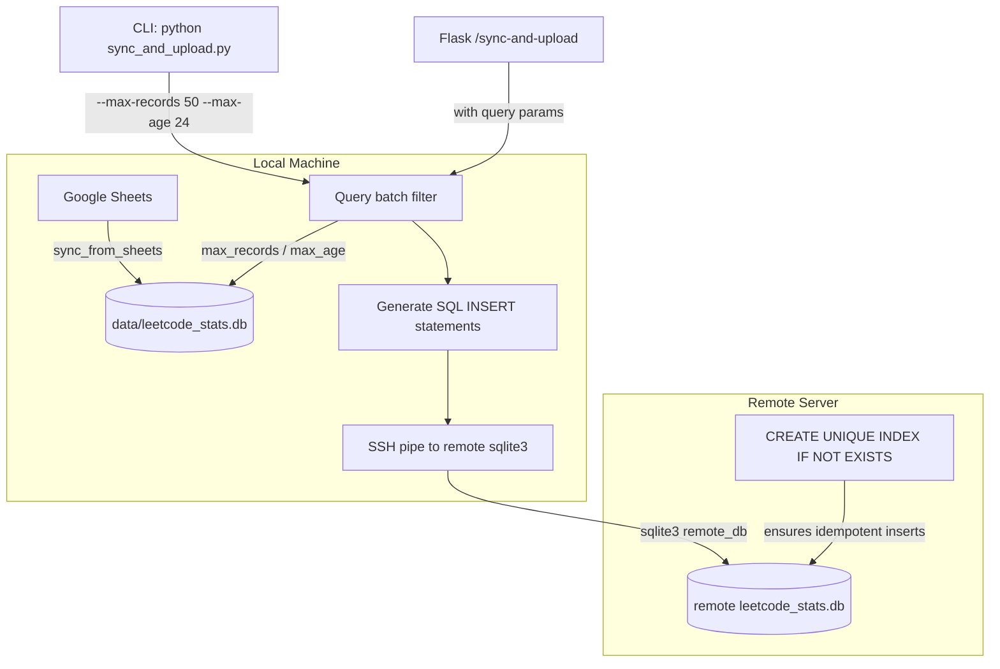
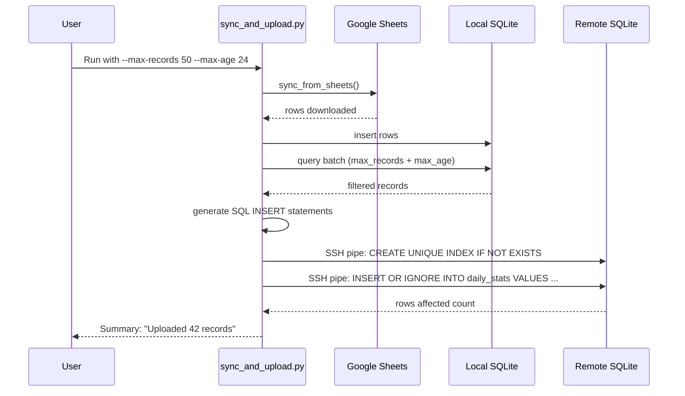

# Sync & Upload with Batch Limiting — Implementation Plan

## Overview

Combine the Google Sheets download and remote SQLite upload into a single process, with options to limit the upload batch by **time** (e.g., last 24 hours) or by **record count** (e.g., last 100 records). Instead of uploading the entire `.db` file, the new process extracts only the matching records from the local DB and pipes SQL `INSERT` statements directly into the remote server's `sqlite3` CLI via SSH.

## Architecture



## Key Design Decisions

| Decision | Choice | Rationale |
|---|---|---|
| Upload mechanism | SQL-pipe via SSH | No extra deps, uses existing SSH setup, `sqlite3` available on remote |
| Conflict handling | `INSERT OR IGNORE` / `INSERT OR REPLACE` | Requires a UNIQUE index on `response_ts` on the remote |
| Batch filter logic | `max_records` AND `max_age_hours` combine | Both filters applied together (intersection) |
| Record ordering | Sort by `response_ts DESC` | Newest records are prioritized for batch limits |
| Unique constraint | `CREATE UNIQUE INDEX IF NOT EXISTS` | Sent as first SQL statement in the pipe to ensure idempotent inserts |

## Remote Table Constraint

The piped SQL will include a `CREATE UNIQUE INDEX IF NOT EXISTS` statement on the remote `response_ts` column. This enables `INSERT OR REPLACE` (for upsert) and `INSERT OR IGNORE` (for insert-only) to work correctly. The index is created only once and is harmless if it already exists.

## Batch Filtering Logic

```python
def query_batch(
    session: Session,
    max_records: int | None = None,
    max_age_hours: int | None = None,
) -> list[DailyStats]:
    """
    Query records from the local DB, filtered by:
    - max_records: only the last N records (by response_ts)
    - max_age_hours: only records newer than N hours ago
    If both are provided, both filters apply (intersection).
    """
    query = session.query(DailyStats).order_by(DailyStats.response_ts.desc())
    
    if max_age_hours is not None:
        cutoff = datetime.now(timezone.utc) - timedelta(hours=max_age_hours)
        query = query.filter(DailyStats.response_ts >= cutoff)
    
    if max_records is not None:
        query = query.limit(max_records)
    
    return query.all()
```

## SQL Generation

```python
def generate_insert_sql(
    records: list[DailyStats],
    table_name: str = "daily_stats",
    upsert: bool = False,
) -> str:
    """
    Generate SQL statements for the given records.
    
    - First statement: CREATE UNIQUE INDEX IF NOT EXISTS (ensures idempotency)
    - Then: INSERT OR IGNORE (or INSERT OR REPLACE for upsert) with all values
    """
```

For safety, the SQL is generated in batches of 100 records per INSERT statement to avoid overwhelming the SSH pipe.

## Files to Create/Modify

### 1. NEW: [`sync_and_upload.py`](sync_and_upload.py)

A standalone module with the combined process.

**Entry point function:**
```python
def sync_and_upload(
    sheet_name: str = "Sheet1",
    upsert: bool = False,
    max_records: int | None = None,
    max_age_hours: int | None = None,
    host: str | None = None,
    port: int | None = None,
    username: str | None = None,
    remote_db_path: str | None = None,
    key_filename: str | None = None,
    verbose: bool = True,
) -> int:
    """
    Download from Google Sheets, then upload filtered records to remote.
    
    Returns the number of records uploaded.
    """
```

**Steps:**
1. Call `init_db()` to ensure local DB is ready
2. Call `sync_from_sheets(sheet_name, upsert)` to download from Google Sheets
3. Query local DB with batch filters (`max_records`, `max_age_hours`)
4. Generate SQL INSERT statements
5. Build SSH command piping to `sqlite3 {remote_db_path}`
6. Execute via `subprocess.Popen` with `stdin=subprocess.PIPE`
7. Parse output to confirm number of rows affected
8. Return count

**CLI entry point:**
```bash
python sync_and_upload.py \
    --sheet Sheet1 \
    --upsert \
    --max-records 50 \
    --max-age 24 \
    --host myserver.com \
    --username deploy \
    --remote-db /home/deploy/data/leetcode_stats.db \
    --key ~/.ssh/id_rsa
```

### 2. MODIFY: [`upload_to_remote.py`](upload_to_remote.py)

Add a new function for the SQL-pipe upload mechanism:

```python
def upload_records_via_sql_pipe(
    records: list[dict],
    remote_db_path: str,
    host: str,
    username: str,
    port: int = 22,
    key_filename: str | None = None,
    table_name: str = "daily_stats",
    upsert: bool = False,
    batch_size: int = 100,
    verbose: bool = True,
) -> bool:
    """
    Upload a list of records to a remote SQLite DB via SSH-piped SQL.
    
    Parameters
    ----------
    records : list[dict]
        Records with keys matching DailyStats columns.
    remote_db_path : str
        Absolute path to SQLite DB on remote server.
    host, username, port, key_filename : SSH connection params.
    table_name : str
        Target table name (default: daily_stats).
    upsert : bool
        If True, use INSERT OR REPLACE; otherwise INSERT OR IGNORE.
    batch_size : int
        Number of records per INSERT statement (default: 100).
    verbose : bool
        Print progress to stderr.
    
    Returns
    -------
    bool
        True on success.
    """
```

This function is reusable — it can also be called with records from other sources (e.g., LeetCode API directly).

### 3. MODIFY: [`config.json`](config.json)

Add a `batch` section:

```json
{
    "user_id": "",
    "spreadsheet_key": "",
    "remote": {
        "host": "",
        "port": 22,
        "username": "",
        "remote_path": "",
        "key_filename": "",
        "remote_db_path": "",
        "batch": {
            "max_records": null,
            "max_age_hours": 24
        }
    }
}
```

- `remote_db_path`: path to SQLite DB on remote (may differ from the SCP `remote_path`)
- `batch.max_records`: default limit on number of records (null = no limit)
- `batch.max_age_hours`: default time window (null = no limit, 24 = last 24 hours)

### 4. MODIFY: [`app.py`](app.py)

Update the `/sync-and-upload` route to accept batch parameters and use the new combined process:

```python
@app.route("/sync-and-upload")
def sync_and_upload():
    """Sync from Google Sheets, then upload filtered records to remote."""
    try:
        from sync_and_upload import sync_and_upload
        
        # Read query parameters
        max_records = request.args.get("max_records", type=int, default=None)
        max_age_hours = request.args.get("max_age_hours", type=int, default=None)
        upsert = request.args.get("upsert", type=str, default="") == "1"
        
        count = sync_and_upload(
            max_records=max_records,
            max_age_hours=max_age_hours,
            upsert=upsert,
        )
        return redirect(url_for("index"))
    except Exception as exc:
        return render_template(
            "index.html",
            latest={},
            summary=get_summary_stats(),
            history=[],
            error=f"Sync + upload failed: {exc}",
        )
```

Keep the existing `/upload-remote` route for the full-file SCP upload as a fallback.

### 5. MODIFY: [`templates/index.html`](templates/index.html)

Replace the current "Sync & Upload" button with a form that allows configuring batch options:

```html
<div class="action-bar">
    <a href="{{ url_for('refresh') }}" class="btn btn-primary">⟳ Fetch from LeetCode</a>
    <a href="{{ url_for('sync_sheets') }}" class="btn btn-secondary">⬇ Sync from Google Sheets</a>
    <a href="{{ url_for('upload_remote') }}" class="btn btn-secondary">☁ Upload Full DB to Remote</a>
    
    <details class="batch-controls">
        <summary class="btn btn-accent">⬇☁ Sync & Upload (Batch)</summary>
        <form class="batch-form" method="GET" action="{{ url_for('sync_and_upload') }}">
            <label>
                Max records:
                <input type="number" name="max_records" min="1" placeholder="e.g. 100">
            </label>
            <label>
                Max age (hours):
                <input type="number" name="max_age_hours" min="1" placeholder="e.g. 24">
            </label>
            <label class="checkbox-label">
                <input type="checkbox" name="upsert" value="1">
                Upsert (update existing)
            </label>
            <button type="submit" class="btn btn-accent">Run</button>
        </form>
    </details>
</div>
```

### 6. MODIFY: [`scheduler.py`](scheduler.py) (optional)

Add a UNIQUE index on `response_ts` to the local DB for consistency:

```python
def init_db():
    Base.metadata.create_all(engine)
    # Create unique index for idempotent inserts
    from sqlalchemy import Index
    index = Index("idx_daily_stats_response_ts", DailyStats.response_ts, unique=True)
    index.create(bind=engine, checkfirst=True)
```

This is optional but recommended for consistency between local and remote schemas.

## Edge Cases & Error Handling

| Scenario | Handling |
|---|---|
| No records match batch filter | Print warning, return 0, skip SSH entirely |
| SSH connection fails | Catch `subprocess.TimeoutExpired`, `FileNotFoundError`; print error |
| SQL syntax error on remote | Capture stderr from `sqlite3`, show in error message |
| Large batch (>1000 records) | Process in chunks of `batch_size` to avoid overwhelming pipe buffer |
| `response_ts` duplicates in batch | `INSERT OR IGNORE` (or `INSERT OR REPLACE` for upsert) handles this |
| Remote DB doesn't exist yet | `sqlite3` creates it automatically, then the `CREATE INDEX` and `INSERT` run |
| `max_records=0` or `max_age_hours=0` | Treated as "no limit" (same as `None`) |
| Both `max_records` and `max_age_hours` provided | Both filters applied; records must satisfy both conditions |

## Mermaid: Detailed Flow



## CLI Usage Examples

```bash
# Upload only the last 50 records, no time filter
python sync_and_upload.py --max-records 50

# Upload records from the last 24 hours, no count limit
python sync_and_upload.py --max-age 24

# Both filters: last 50 records AND only from the last 24 hours
python sync_and_upload.py --max-records 50 --max-age 24

# Upsert mode (update existing matching records)
python sync_and_upload.py --max-records 100 --upsert

# Full control with all options
python sync_and_upload.py \
    --sheet Sheet1 \
    --upsert \
    --max-records 100 \
    --max-age 48 \
    --host myserver.com \
    --port 2222 \
    --username deploy \
    --remote-db /home/deploy/data/leetcode_stats.db \
    --key ~/.ssh/deploy_key \
    --verbose